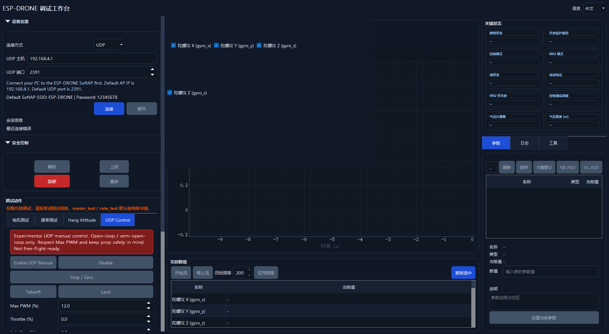

# ESP32 SoftAP + UDP Transport

This is the network transport layer for the existing binary CLI/GUI protocol. It is not a free-flight mode and does not change the experimental status of UDP manual control.

## Defaults

- SoftAP SSID: `ESP-DRONE`
- SoftAP password: `12345678`
- AP IP: `192.168.4.1`
- UDP protocol port: `2391`
- Wi-Fi channel: `6`
- Max stations: `2`

The firmware starts the SoftAP after USB CDC console initialization. If Wi-Fi startup fails, USB CDC remains available for logs and recovery.

## Parameters

The current parameter system supports numeric and boolean values, not strings. Therefore SSID and password are firmware defaults in `firmware/main/network/wifi_ap.h`.

Current configurable parameters:

- `wifi_ap_enable`: enable SoftAP on boot, default `true`.
- `wifi_ap_channel`: SoftAP channel, valid `1..13`, default `6`.
- `wifi_udp_port`: binary CLI/GUI UDP protocol port, default `2391`.

Reserved for a future small extension:

- `wifi_ap_ssid`
- `wifi_ap_password`

Password handling rule for that future string extension: WPA2 SoftAP passwords must be at least 8 characters. If a configured password is shorter than 8 characters, firmware should either reject it or explicitly fall back to open-network mode with a clear warning. Open-network mode is not recommended and is not the default.

## Firmware Log Examples

Expected startup events:

```text
softap started ssid=ESP-DRONE channel=6 ip=192.168.4.1 udp_port=2391
udp protocol listening addr=0.0.0.0 port=2391
```

Expected station events:

```text
softap station connected aid=1
softap station disconnected aid=1
```

Failure example:

```text
softap start failed at esp_wifi_start: ESP_FAIL
```

## GUI Connection Flow

1. Power the ESP-DRONE board.
2. Connect the PC Wi-Fi to SSID `ESP-DRONE` with password `12345678`.
3. Open the Python GUI.
4. In `Connection`, set `Link` to `UDP`.
5. Keep `UDP Host = 192.168.4.1` and `UDP Port = 2391`.
6. Click `Connect`.
7. Confirm the GUI shows `Connected` plus device info.

If UDP connection fails, use USB CDC / Serial mode to inspect event logs first.

## CLI Smoke Test

After joining the SoftAP:

```powershell
python -m esp_drone_cli --udp 192.168.4.1:2391 connect
python -m esp_drone_cli --udp 192.168.4.1:2391 capabilities
python -m esp_drone_cli --udp 192.168.4.1:2391 udp-manual enable
python -m esp_drone_cli --udp 192.168.4.1:2391 udp-manual stop
```

Use a restrained bench and conservative `udp_manual_max_pwm` before any motor-producing command.

## Safety Boundary

- Serial / USB CDC remains the primary recovery and debug path.
- UDP manual control remains experimental; throttle is a collective/base duty target, roll/pitch use the flat-ground reference outer loop, and yaw uses the rate PID before mixing.
- Kill and disarm continue to use the existing highest-priority safety path.
- UDP manual watchdog behavior remains unchanged: stale setpoints zero manual yaw, keep roll/pitch on attitude hold, reduce throttle, and then disarm on extended timeout.
- This transport update does not make the vehicle free-flight ready.

## Screenshot

GUI UDP transport connection page:


