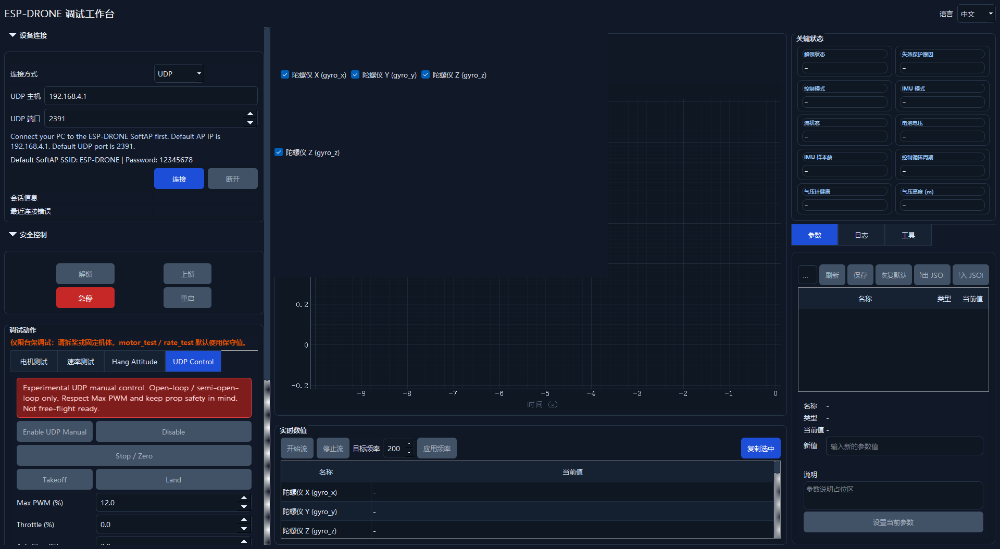

# ESP32 WiFi Debug Transport: SoftAP + STA

This is the network transport layer for the existing binary CLI/GUI protocol. It is not a free-flight mode and does not change the experimental status of UDP manual control.

## Defaults

- WiFi mode: `sta` (falls back to SoftAP when `sta_ssid` is empty)
- SoftAP SSID: `ESP-DRONE`
- SoftAP password: `12345678`
- AP IP: `192.168.4.1`
- UDP protocol port: `2391`
- Wi-Fi channel: `6`
- Max stations: `2`

The firmware starts WiFi after USB CDC console initialization. Default behavior is unchanged: SoftAP starts at `192.168.4.1:2391`. STA mode is optional and can join a router or phone hotspot so the PC can stay online for Codex while using the same LAN to reach the drone.

## Parameters

Current configurable parameters:

- `wifi_mode`: `softap`, `sta`, or `apsta`; default `softap`.
- `wifi_ap_enable`: enable SoftAP on boot, default `true`.
- `wifi_ap_channel`: SoftAP channel, valid `1..13`, default `6`.
- `wifi_udp_port`: binary CLI/GUI UDP protocol port, default `2391`.
- `sta_ssid`: router or phone hotspot SSID for STA mode.
- `sta_password`: STA password; empty only for an open test network.
- `sta_static_ip`: optional static IPv4 address. Leave empty for DHCP.
- `sta_gateway`: optional gateway used with `sta_static_ip`.
- `sta_netmask`: optional netmask used with `sta_static_ip`.

`wifi_udp_port` is reused for UDP command, parameter, and telemetry frames. The firmware UDP socket binds `0.0.0.0`, so the same protocol works on SoftAP and STA. There are no separate `udp_control_port` / `udp_telemetry_port` parameters today.

Parameter writes are RAM-only until the user explicitly runs `save`; do not automatically persist WiFi credentials from a diagnostic command.

## Recommended Network Patterns

- Short term: keep using SoftAP for the drone, and keep the PC online through wired Ethernet or phone USB tethering.
- Long term: set `wifi_mode=sta`, configure the drone to join a phone hotspot or router, and connect the PC to the same LAN. Use the IP printed by the firmware log.
- Recovery: keep SoftAP as the fallback configuration entry. If STA has no SSID or cannot reconnect after retries, firmware starts SoftAP again.

## Firmware Log Examples

Expected startup events:

```text
softap started ssid=ESP-DRONE channel=6 ip=192.168.4.1 udp_port=2391
udp protocol listening addr=0.0.0.0 port=2391
```

Expected STA events:

```text
sta connecting ssid=my-hotspot udp_port=2391
sta connected ip=192.168.50.42 udp_port=2391
```

STA fallback example:

```text
sta reconnect failed; falling back to softap
sta fallback softap started ssid=ESP-DRONE channel=6 ip=192.168.4.1 udp_port=2391
```

Expected station events:

```text
softap station connected aid=1
softap station disconnected aid=1
```

Failure example:

```text
wifi start failed at esp_wifi_start: ESP_FAIL
```

## GUI Connection Flow

### SoftAP (Default)

1. Power the ESP-DRONE board.
2. Connect the PC Wi-Fi to SSID `ESP-DRONE` with password `12345678`.
3. Open the Python GUI.
4. In `Connection`, set `Link` to `UDP`.
5. Keep `Mode = SoftAP`, `UDP Host = 192.168.4.1`, and `UDP Port = 2391`.
6. Click `Connect`.
7. Confirm the GUI shows `Connected` plus device info.

### 最简单 STA/AP+STA 配置流程 (Simplest STA/AP+STA Configuration)

The GUI now provides a built-in **WiFi Settings** panel (left sidebar, below Safety Control) that eliminates manual parameter editing:

1. Open the Python GUI.
2. Connect via **Serial** to the drone's USB CDC port.
3. In the **WiFi 设置** (WiFi Settings) section:
   - Select WiFi mode: **AP+STA** (recommended) or **STA**.
   - Enter your home WiFi **SSID** and **password**.
   - Optionally fill static IP, gateway, and netmask.
4. Click **写入 WiFi 配置** (Write WiFi Config) — the GUI writes `wifi_mode`, `sta_ssid`, `sta_password`, and optional static IP params in order, then verifies each.
5. Click **保存并重启** (Save & Reboot) — confirm the dialog, the GUI saves params to NVS, reboots the drone, and disconnects.
6. Wait for the drone to reboot. Check serial logs for `sta connected ip=...`.
7. In the GUI, switch `Link` to **UDP**, set `Mode` to **STA**, enter the printed IP in `UDP Host`, keep port `2391`.
8. Click `Connect`.

> **Recovery note**: AP+STA keeps the SoftAP at `192.168.4.1` as a fallback. Pure STA mode flashes a warning — if STA config is wrong, recover via USB serial or the SoftAP fallback.

### Legacy STA GUI Flow

The manual parameter approach below still works but the WiFi Settings panel above is recommended:

1. Set `wifi_mode=sta`, `sta_ssid`, and `sta_password` over serial or SoftAP; use RAM first and only save after confirming the values.
2. Reboot or restart WiFi so the firmware joins the hotspot/router.
3. Read the `sta connected ip=...` event from serial logs.
4. In the GUI, set `Link = UDP`, `Mode = STA`, `UDP Host = <printed IP>`, and `UDP Port = 2391`.
5. Connect. If communication drops, the GUI stops active UDP manual flow and firmware clears active motor/control state.

If UDP connection fails, use USB CDC / Serial mode to inspect event logs first.

Example STA parameter sequence:

```powershell
python -m esp_drone_cli --serial COM7 set wifi_mode string sta
python -m esp_drone_cli --serial COM7 set sta_ssid string MyHotspot
python -m esp_drone_cli --serial COM7 set sta_password string MyPassword
python -m esp_drone_cli --serial COM7 get wifi_mode
python -m esp_drone_cli --serial COM7 save
python -m esp_drone_cli --serial COM7 reboot
```

## CLI Smoke Test

After joining the SoftAP:

```powershell
python -m esp_drone_cli --udp 192.168.4.1:2391 connect
python -m esp_drone_cli --udp 192.168.4.1:2391 capabilities
python -m esp_drone_cli --udp 192.168.4.1:2391 udp-manual enable
python -m esp_drone_cli --udp 192.168.4.1:2391 udp-manual stop
```

STA target example after firmware logs `sta connected ip=192.168.50.42`:

```powershell
python -m esp_drone_cli --host 192.168.50.42 connect
python -m esp_drone_cli --host 192.168.50.42 capabilities
python -m esp_drone_cli --host 192.168.50.42 udp-manual enable
python -m esp_drone_cli --host 192.168.50.42 udp-manual stop
```

Use a restrained bench and conservative `udp_manual_max_pwm` before any motor-producing command.

## Safety Boundary

- Serial / USB CDC remains the primary recovery and debug path.
- UDP manual control remains experimental; throttle is a collective/base duty target, roll/pitch use the flat-ground reference outer loop, and yaw uses the rate PID before mixing.
- Kill and disarm continue to use the existing highest-priority safety path.
- UDP manual watchdog behavior remains unchanged: stale setpoints zero manual yaw, keep roll/pitch on attitude hold, reduce throttle, and then disarm on extended timeout.
- STA disconnect immediately clears active motor tests/control state, stops motors, disables telemetry streaming, and requests disarm. WiFi reconnect does not arm the vehicle or restart a test.
- This transport update does not make the vehicle free-flight ready.

## Screenshot

GUI UDP transport connection page:


